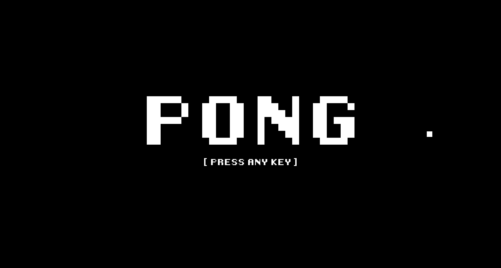
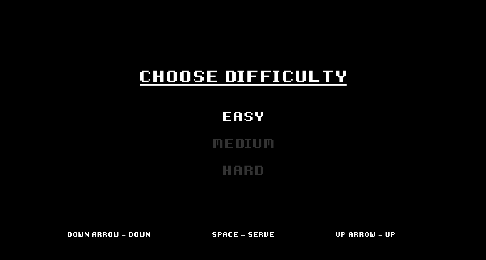
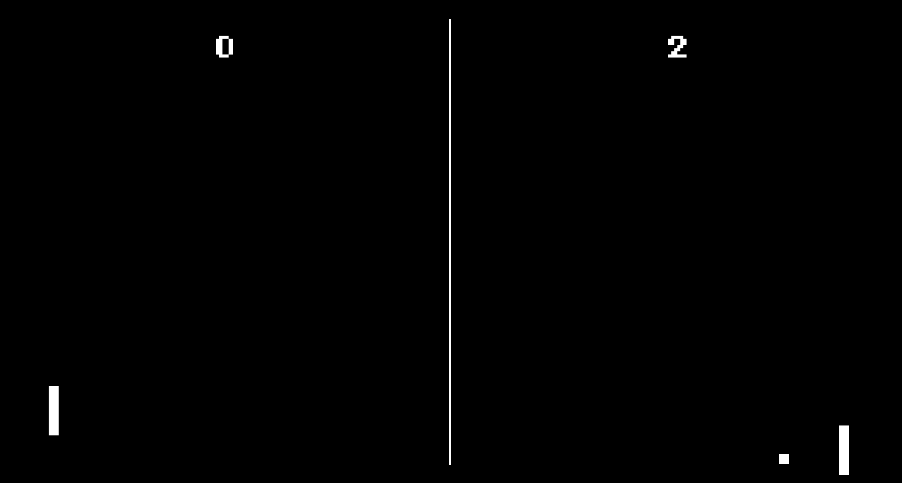

## **Pong**

Pong is a clone of the Atari game pong released in 1972 created with python using pygame.

### _Features_

- Play a single player game of pong.

- Win against your opponent to unlock the next difficulty!

- Enjoy!

## Table of Contents

- [**Whoo**](#listening-lobby)
  - [_Features_](#features)
- [Table of Contents](#table-of-contents)
- [Usage](#usage)
- [Built With](#built-with)
- [Future Updates](#future-updates)
- [Authors](#authors)
- [Support](#support)

## Usage

1. Start by downloading the pong.exe file found in the dist branch.
2. Run the pong.exe.
3. Choose your difficulty.

  

4. Congrats, you are now playing pong! 🎉
5. Now beat your opponent by scoring 11 points to unlock the next difficulty!

  

6. Can you complete all 3 difficulties? 🕹️

## Built With

- Python 🐍
- Pygame 🕹️

## Future Updates

- [ ] Power ups - _Spice things up with in-game power ups and abilites._
- [ ] Multiplayer - _Play locally with a friend using the same keyboard._
- [ ] Game modes - _Add new fun and exciting game modes._

## Authors

**Alexis Martin**

- [GitHub Profile](https://github.com/webdevlex)
- [Personal Website](https://webdevlex.com/)
- [Email: webdeveloperlex@gmail.<area>com ✉️](mailto:webdeveloperlex@gmail.com?subject=Pong-Game 'webdeveloperlex@gmail.com')
